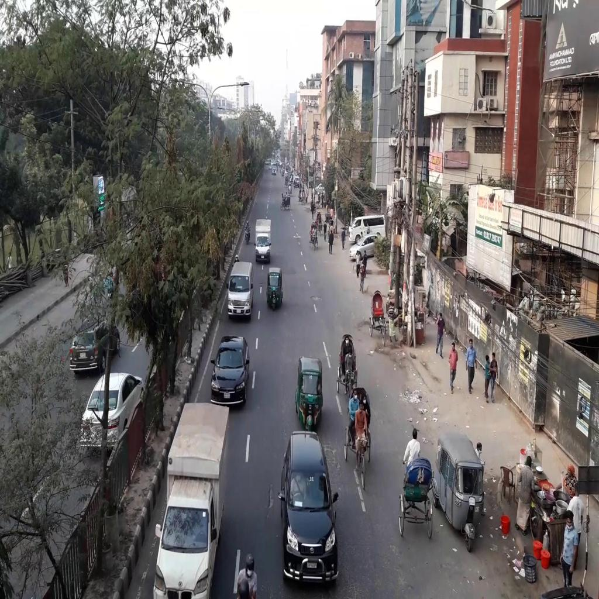

# Vehicle Detection Dataset - Bangladeshi Roads
This dataset was created for being used as an external dataset for the DhakaAI - 2020 competition. [Here](https://www.kaggle.com/rifat963/dhakaai-dhaka-based-traffic-detection-dataset) is the main dataset which was provided by the competition organizers. 

### Download Dataset

* Google Drive Link : https://drive.google.com/file/d/1hkvUf_mGa-bGSPtaHlCMgoTsm9FcNUCl/view?usp=sharing

* Kaggle Link : https://www.kaggle.com/nazmultakbir/vehicle-detection-bangladeshi-roads

### Content

The labels are in the Yolo format [classid, xcenter, ycenter, width, height]
Box coordinates are normalized in xywh format (from 0 - 1)

There are 21 categories of vehicles :
* ['bus',  'rickshaw',  'motorbike',  'car',  'three wheelers (CNG)',  'pickup',  'minivan',  'suv',  'van',  'taxi',  'truck',  'bicycle',  'policecar',  'ambulance',  'human hauler',  'wheelbarrow',  'minibus',  'auto rickshaw',  'army vehicle',  'scooter',  'garbagevan']

The classids in the labels use 0 indexing. 

The classid of each class is based on the position of the classname in the list above. For example: classid of bus is 0 and the classid of car is 3.

The dataset has 720 .jpg images and their annotations in 720 .txt files

### Organization of Files
```
-- Roads of Bangladesh - Vehicle Detection and Classification Dataset
      -- Images
          --pic1.jpg
          --pic2.jpg
          ...
      -- Labels
          --pic1.txt
          --pic2.txt
          ...
```

### Dataset Example
<table>
  <tr>
    <td>  </td>
    <td>  </td>
  </tr>
  <tr>
    <td>  </td>
    <td>  </td>
  </tr>
  <tr>
    <td>  </td>
    <td>  </td>
  </tr>
</table>

### Acknowledgements

The pictures were taken by [Nazmul Takbir](https://www.kaggle.com/nazmultakbir) and [Sihat Afnan](https://www.kaggle.com/sihatafnan).
Annotation was done was by [Nazmul Takbir](https://www.kaggle.com/nazmultakbir), [Sihat Afnan](https://www.kaggle.com/sihatafnan) and [Tanjim Ahmed](https://www.kaggle.com/tanjimahmedkhan).

We used [CVAT](https://cvat.org) for annotating our images.

###  Improvements

We would have loved to create a much larger dataset, but we couldn't do that due to time constraints during the competition (unfortunately we did not know external dataset could be used until the last week of the competition). 

This dataset was created from scratch in 1 day  
